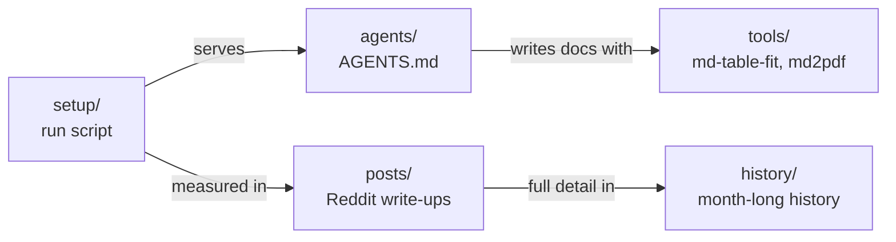

# local-inference-setup

Running **Qwen3.8-Flash-Next** (176B-total / ~6B-active MoE) on a **Mac mini M4 Pro, 64 GB**: the exact setup, measured speeds, and a month of notes on what helped. Plus the agent instructions and small tools I use with it.

## Current setup (October 2026)

| Part | What | From |
|---|---|---|
| Model | Swift 1.5 GSQ-RCO **IQ3_XXS** | [ukisai/Swift-1.5-Qwen3.8-Flash-Next-GSQ-RCO-GGUF](https://huggingface.co/ukisai/Swift-1.5-Qwen3.8-Flash-Next-GSQ-RCO-GGUF) |
| MTP head | `MTP/mtp-Qwen3.8-Flash-Next-shared-Q8_0.gguf` | [unsloth/Qwen3.8-Flash-Next-GGUF](https://huggingface.co/unsloth/Qwen3.8-Flash-Next-GGUF) |
| Server | llama.cpp fork **b11443-mix-d65395f** | [unslothai/llama.cpp](https://github.com/unslothai/llama.cpp/releases/tag/b11443-mix-d65395f) |
| Script | 262k context, MTP 6 / p-min 0.8, optional vision | [`setup/run-swift-mtp.sh`](setup/run-swift-mtp.sh) |

Decode on real agent work at 64–128k context: **~23 t/s median**. Memory: 56.7 GiB wired at idle of a 60 GiB GPU limit; swap stays flat.

## What's here

| Folder | Contents |
|---|---|
| [`posts/`](posts/) | [2026-10: one llama.cpp upgrade beat a month of tuning](posts/2026-10-one-upgrade.md) (latest; [Reddit body](posts/2026-10-one-upgrade-reddit.md)) · [2026-09: the original setup](posts/2026-09-swift-m4pro.md) (superseded) |
| [`history/`](history/flash-next-history.md) | The whole month: who supplies which part (Qwen, AtomicChat, ISTA-DASLab, UkisAI, Unsloth, ggml-org), the timeline, decode by era, quality vs BF16, tried and rejected |
| [`setup/`](setup/) | The run script, with download commands in its header |
| [`agents/`](agents/) | My global `AGENTS.md` for coding agents (Claude Code, pi) and the vendored PONYTAIL rules |
| [`tools/`](tools/) | [`md-table-fit`](tools/md-table-fit): wrap over-wide Markdown tables, `--join` to unwrap · [`md2pdf`](tools/md2pdf): Markdown to PDF offline, Mermaid drawn · [`llama-perf`](tools/llama-perf): live llama.cpp t/s and MTP stats in pi |

SQL tools (SQL Server 2016 query checker, T-SQL keyword-river formatter) live in [leastsurprise/sql-tools](https://github.com/leastsurprise/sql-tools).

Speeds were measured on this machine; quality figures (KLD, benchmarks) are the publishers' own.
