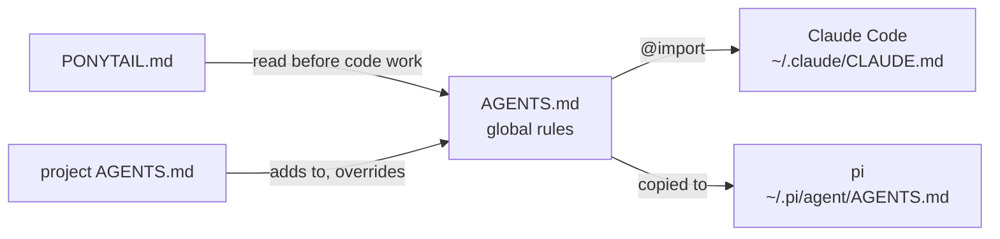

# agents: the rules my coding agents follow

Two Markdown files that every coding agent I run loads at the start of every
session. That includes the local Flash-Next model under
[pi](https://github.com/badlogic/pi-mono), and Claude Code.

- **[AGENTS.md](AGENTS.md)** sets how to work with me in any project:
  headline first, scope to the ask, list loose ends instead of chasing them,
  check in every ~10 tool calls, and explain top-down with small Mermaid
  diagrams that are checked to render, with a PDF shipped beside the
  Markdown ([md2pdf](../tools/md2pdf/)). These rules matter more for a local
  model: at 20–30 t/s, every tool call it skips saves real time.
- **[PONYTAIL.md](PONYTAIL.md)** covers how to write code: the least code
  that works (YAGNI, then reuse, then the standard library, then platform
  features, and only then new code). It is vendored unchanged from
  [DietrichGebert/ponytail](https://github.com/DietrichGebert/ponytail)
  (MIT); the front matter records where it came from.

A project's own `AGENTS.md` adds to these and wins where the two conflict. A
project can opt out of PONYTAIL with `ponytail: off`.



## Install

**Claude Code** reads `~/.claude/CLAUDE.md` in every project, and `@path`
lines in it import other files:

```markdown
# ~/.claude/CLAUDE.md
@/path/to/local-inference-setup/agents/AGENTS.md
```

AGENTS.md tells the agent to read `PONYTAIL.md` from beside it, so keep the
two files together.

**pi** reads `~/.pi/agent/AGENTS.md` as its global context. Copy both files
there. Use real copies rather than symlinks if pi runs in a container that
mounts only `~/.pi`:

```sh
cp agents/AGENTS.md agents/PONYTAIL.md ~/.pi/agent/
cp tools/md2pdf/pi-extension/md2pdf.js ~/.pi/agent/extensions/   # optional: auto-PDF
```

## Make it yours

AGENTS.md is written about me ("Mike", "the user"). Change the name, and
keep the rules that suit how you work. The "How the user learns" section
describes my preference for visual, top-down explanation; replace it with
yours.
