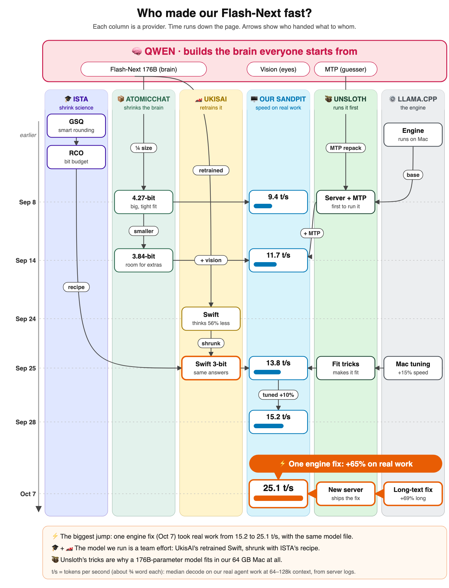
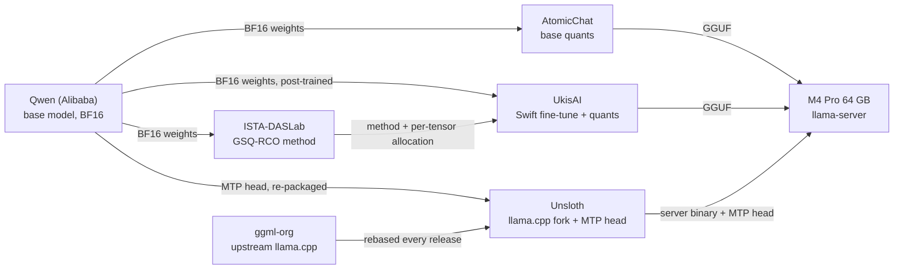
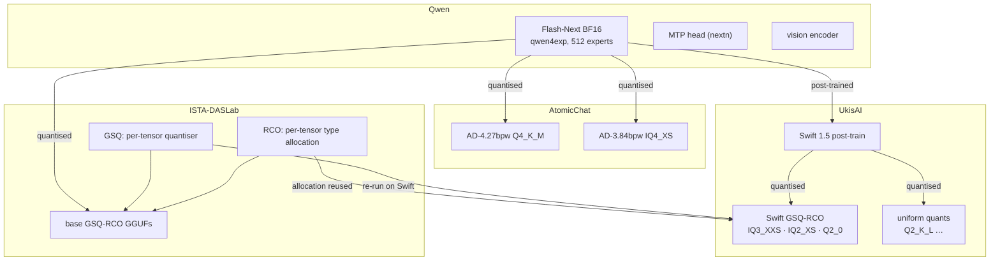
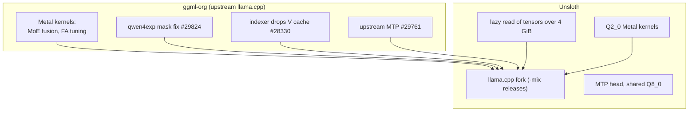
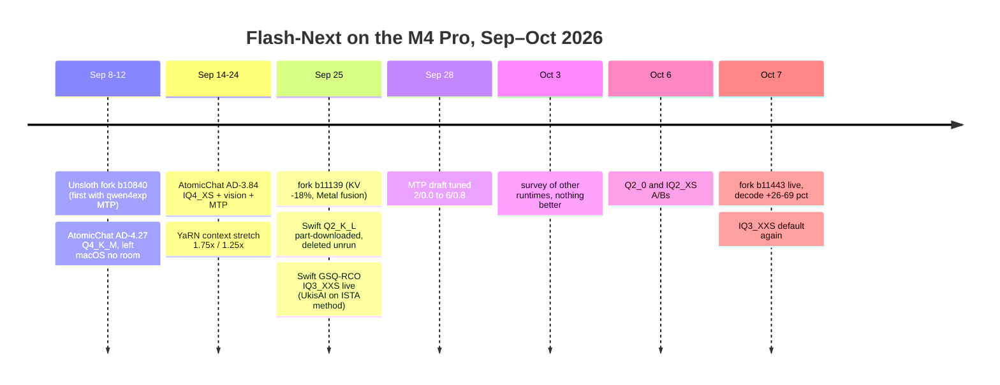
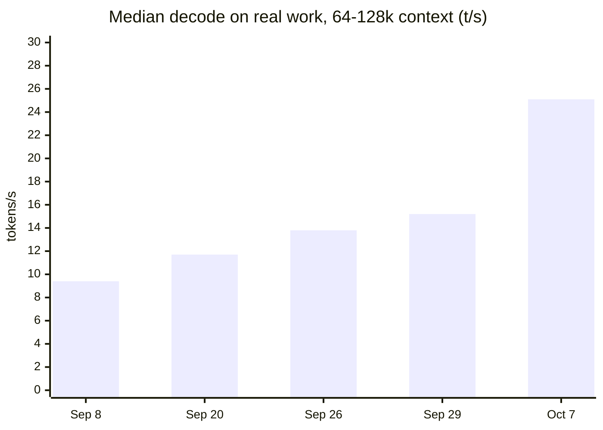
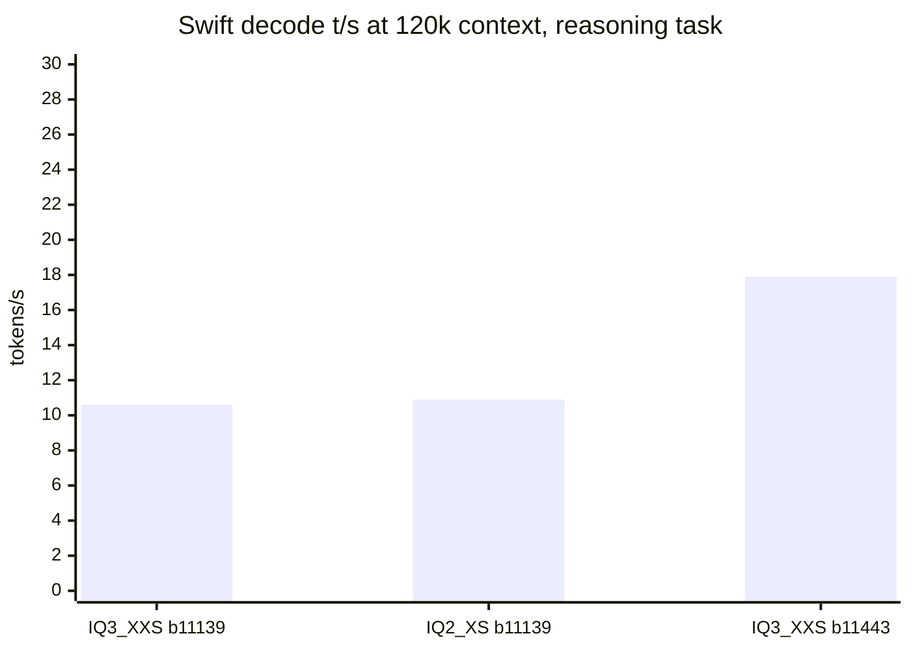
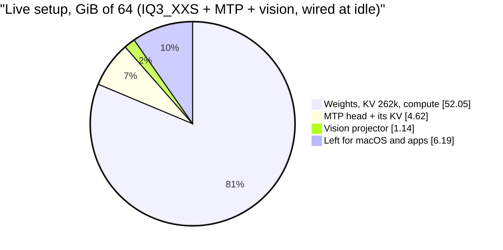

# Running Qwen3.8-Flash-Next on a 64 GB Mac: providers, runtimes, speeds

A history of the Flash-Next builds run on the Mac mini M4 Pro (64 GB) from
September 8 to October 8, 2026: who made each part, how much decode speed
each change bought, and how much quality each smaller build gave up.

## At a glance

*Each column is a provider; time runs down the page. Source:
`img/make_silos.py` writes `img/flash-next-silos.svg`; the PNG is a headless
Chrome screenshot of that SVG, so the emoji render in colour.*

> **The headline: one llama.cpp upgrade was the biggest step of the month.**
> Unsloth fork build b11443 (October 7) carries upstream's `qwen4exp`
> attention-mask fix. With no other change, the live model decoded **+26% at
> 16k, +48% at 64k and +69% at 120k context**: at 120k, 10.6 → 17.9 t/s on
> reasoning and 16.0 → 26.1 on copy work. That beat MTP itself (+49% at
> 139k) and every switch to a smaller model (+4–14%). On real agent work at
> 64–128k context, median decode went from 15.2 to 25.1 t/s (+65%). See
> section 4.

Sources are my run-script headers, the fork release notes, my A/B test
results and server logs, plus the earlier write-up in
[`posts/2026-09-swift-m4pro.md`](../posts/2026-09-swift-m4pro.md). Quality
figures are the publishers' own; speed figures were measured on this machine.

---

## 1. The 50,000-foot view

Six groups supply the parts. Qwen is the source of everything. Two
supply **weights** (AtomicChat, UkisAI), one supplies the **quantisation
method** behind the current build (ISTA), and two supply the **runtime** that
serves it (ggml-org, Unsloth).

| Provider | What they specialise in | What I used from them |
|---|---|---|
| **Qwen** (Alibaba) | Trains the model. Qwen3.8-Flash-Next is a 176B-total / ~6B-active MoE (512 experts, 10 per token) with a new `qwen4exp` architecture, a built-in MTP (multi-token prediction) head, a vision encoder and native 262,144-token context. | Everything else is derived from it. Never run directly: BF16 is far too big for 64 GB. |
| **AtomicChat** | Quantisation of the *base* model into GGUF, sized to fit 64 GB machines (the "M64" builds), with published KLD numbers. | AD-4.27bpw Q4_K_M (September 8–12, and retested September 25) and AD-3.84bpw IQ4_XS (September 14–24), plus the F16 vision projector. |
| **ISTA-DASLab** (IST Austria) | **Quantisation research.** They created GSQ (Gumbel-Softmax Quantization: learns each tensor's low-bit grid and scales) and RCO (Riemannian Constrained Optimization: picks a quant type for every tensor under a size budget). They publish GSQ-RCO GGUFs of the *base* model (Q2_0, IQ2_XS, IQ3_XXS, IQ3_S), plus a pruned Coder variant. | The method and per-tensor allocation behind the live Swift build. Their base-model builds were checked on October 6 and not adopted (section 7). |
| **UkisAI** | **Post-training** (the Swift 1.5 fine-tune, which thinks about 56% less for nearly the same answers), then applying ISTA's GSQ-RCO to Swift, with published KLD. | Swift 1.5 GSQ-RCO IQ3_XXS, live since September 25 apart from one day on IQ2_XS (October 7). IQ2_XS and Q2_0 were A/B tested. Their uniform Q2_K_L was partly downloaded, then deleted without being run. Also their BF16 vision projector. |
| **Unsloth** | A **llama.cpp fork** that ships new-architecture support before upstream does, plus GGUF packaging, including the MTP head as a separate file. | Every server binary (b10840, b11139, b11443) and the `mtp-…-shared-Q8_0.gguf` draft head. |
| **ggml-org** | **Upstream llama.cpp**: the Metal kernels, attention and MoE fusion, and bug fixes. | Indirectly: each Unsloth release is upstream plus Unsloth's patches, so upstream fixes reach me through the fork. |

### How they build on each other

- **Qwen → AtomicChat / UkisAI.** Both start from Qwen's BF16 weights.
  AtomicChat only quantises. UkisAI first post-trains Swift, then quantises
  it. Their KLD figures therefore measure different things: AtomicChat's
  measure distance from *base* BF16, UkisAI's from *Swift* BF16.
- **ISTA → UkisAI. The live model is a hybrid.** UkisAI's recipe file says
  "Swift-specific GSQ refinement with reused ISTA GSQ-RCO per-tensor
  allocation profiles". ISTA decided which quant type each tensor gets, and
  UkisAI re-ran GSQ on the Swift weights in two refinement passes. So the
  weights are UkisAI's, the quant recipe is ISTA's, and the quality tracks
  ISTA's tier for tier (~0.117 KLD at IQ3_XXS on code and prose).
- **Qwen → Unsloth.** AtomicChat's quants dropped the MTP (`nextn`) tensors.
  Unsloth re-packaged Qwen's base head as a separate 2.6 GB "shared" GGUF that
  borrows the main model's embedding and output layers. No Swift-trained head
  exists, so the Swift setup drafts with the base model's head, and it still
  gets 75–94% acceptance.
- **ggml-org ↔ Unsloth.** Unsloth carries patches upstream doesn't have yet:
  MTP for `qwen4exp`, lazy reading of tensors over 4 GiB, Metal kernels for
  `Q2_0`. It rebases onto upstream at every release. The biggest single speed
  gain in this history (#29824, the `qwen4exp` attention-mask fix) came from
  upstream. By b11443 Unsloth had also dropped its own MTP patch in favour of
  upstream's (#29761).
- **ISTA / UkisAI ← Unsloth.** GSQ-RCO's allocation puts some experts in
  `Q2_0` (30 of the 48 `ffn_down` layers in the live IQ3_XXS), and only the
  Unsloth fork has Metal kernels for it. Swift GSQ-RCO is only runnable here
  because of the fork.

### ISTA's two methods in plain English

GSQ-RCO is two papers from ISTA-DASLab, used together:

- **GSQ: smart rounding.** [*GSQ: Highly-Accurate Low-Precision Scalar
  Quantization for LLMs via Gumbel-Softmax Sampling*](https://arxiv.org/abs/2604.18556)
  ([code](https://github.com/IST-DASLab/GSQ)). Squeezing a weight to 2–3 bits
  means rounding it to one of a handful of levels. Simple rounding loses
  accuracy below 3–4 bits. The fancier "vector" methods that do better are
  hard to build and need special kernels. GSQ instead *learns* which level
  each weight goes to, and the scale of each group, by optimising a soft,
  differentiable version of the choice. It closes most of the gap to the
  fancy methods at 2–3 bits, and the output is still an ordinary format that
  llama.cpp's existing kernels can run.
- **RCO: the bit budget.** [*Model Compression with Exact Budget
  Constraints via Riemannian Manifolds*](https://arxiv.org/abs/2605.00649)
  ([code](https://github.com/IST-DASLab/RCO)). With a fixed file size, which
  tensors deserve more bits? RCO picks a quant type for every tensor and
  trains the choice by gradient descent on the model's actual loss. It hits
  the size budget exactly at every step, with no penalty weights to tune.
- **Together:** RCO decides *how many* bits each tensor gets; GSQ makes the
  best use of those bits. On Flash-Next, 95% of the weights are routed
  experts, so the budget is spent mostly there, layer by layer.
  The result is a non-uniform GGUF. That is why Swift IQ3_XXS, at about
  3 bits per weight, matches an ordinary 4-bit quant on accuracy.

---

## 2. The silos in detail: who supplies which component

The picture at the top is the simple version. These two diagrams name the
actual components.

### Weights side

### Runtime side

What each component buys on a 64 GB machine:

| Component | From | Why it matters here |
|---|---|---|
| GSQ-RCO allocation | ISTA, applied by UkisAI | Spends bits where they matter most per tensor. IQ3_XXS at ~0.12 KLD is about standard IQ4_XS quality at ~3 bpw, which is why a 176B model fits beside MTP and vision. |
| Lazy read of tensors over 4 GiB | Unsloth | Keeps Swift's 26.8 GiB n-gram table out of pinned GPU memory. Without it, Swift doesn't fit at all. |
| `Q2_0` Metal kernels | Unsloth | GSQ-RCO puts some experts in `Q2_0`. Upstream has no Metal kernel for it. |
| MTP for `qwen4exp` | Unsloth #144, later upstream #29761 | Speculative decoding: +49% decode at 139k context. Upstream had none until October 1. |
| Indexer drops its V cache (#28330) | ggml-org | KV cache 17,952 → 14,688 bytes/token (−18%), ~0.8 GiB saved at 262k. |
| `qwen4exp` mask fix (#29824) | ggml-org | The b11443 jump: +26% decode at 16k, rising to +69% at 120k. |
| Metal MoE fusion, FA tuning (#28948, #29075) | ggml-org | Part of the b10840 → b11139 gain (+13–20% decode with MTP). |

---

## 3. Timeline

| When | Change | Provider | Decode effect (measured here) |
|---|---|---|---|
| Sep 8–12 | Unsloth fork b10840 + **AD-4.27bpw Q4_K_M** (first build run; MTP tried Sep 12) | AtomicChat + Unsloth | Baseline **~10–11 t/s** without MTP (AD-3.84 later decoded the same: memory-bound). Most accurate build that fit, but it pinned 51.6 GiB and left macOS ~0.6 GiB, so the desktop was unusable and swap kept growing. With MTP the context had to drop to 131k. |
| Sep 14–24 | **AD-3.84bpw IQ4_XS** + vision + MTP, 262k (daily driver) | AtomicChat + Unsloth head | **15.0 t/s** median (21.3 shallow), 77% acceptance, prefill 141. Only 853 MB RAM free. |
| Sep 19–24 | YaRN context stretch (1.75×, then 1.25× = 327,680) | – | 1.25× with MTP: 16.8 t/s, 70% acceptance, but no room for vision. Dropped: split the work instead. |
| Sep 25, morning | **Fork b11139**, benchmarked on AD-3.84 and AD-4.27 | ggml-org via Unsloth | Decode **+13–20%** with MTP, prefill +4–28%, KV −18%. |
| Sep 25, ~noon | Swift 1.5 **Q2_K_L** (UkisAI's uniform quant) | UkisAI | Download started, then stopped and deleted within the hour once its card showed only 77% top-token agreement. **Never run.** |
| Sep 25, afternoon | **Swift 1.5 GSQ-RCO IQ3_XXS** replaces the AD builds (downloaded 14:51–15:14, first tests 18:18, AD-4.27 deleted that evening) | UkisAI (ISTA method) | Pinned weights 43.7 vs 51.6 GiB. With MTP: 19.9 t/s at 16k, **11.6 at 139k (vs 7.8 without MTP, +49%)**, 25.9 on SQL chat. Same accuracy as AD-4.27 on my tests, with 8–24% fewer thinking tokens. |
| Sep 28 | MTP draft n-max 2 → 6, p-min 0 → 0.8 | (tuning) | **+13–14%** on code (22.5 → 25.4 at 28k, 19.5 → 22.3 at 59k); prose within noise. |
| Oct 3 | Survey: MTPLX, oMLX, LM Studio, upstream, b11160 | – | Nothing usable on 64 GB. |
| Oct 6 | ISTA's base GSQ-RCO builds reviewed | ISTA | Not adopted: same quant error as Swift tier for tier, but base thinks ~1.7× longer. |
| Oct 6 | Swift **Q2_0** and **IQ2_XS** A/Bs | UkisAI (ISTA method) | Q2_0 **+9–14%** on copy work; IQ2_XS +4–11%. Both ~8 GiB less wired. ISTA's claimed 3.4× prefill for Q2_0 (lookup-table-free) was only +1–3% on Metal. |
| Oct 7 | IQ2_XS made default (for one day) | UkisAI | – |
| Oct 7 | **⚡ Fork b11443** (upstream #29824 mask fix) — **the step change** | ggml-org via Unsloth | IQ3_XXS: **+26–28% at 16k, +45–51% at 64k, +63–69% at 120k**. IQ3_XXS now decodes as fast as IQ2_XS, so IQ3_XXS is the default again. Vision chart test: 24.8 → 30.0 t/s. |

---

## 4. Decode speed: where the gains came from

### The step change: llama.cpp b11443

Same model file (Swift IQ3_XXS), same MTP head, same 6/0.8 draft settings,
same prompts. Only the server binary changed, from b11139 to b11443.

```mermaid
xychart-beta
    title "Decode t/s, reasoning: dark = b11139, light = gain from b11443"
    x-axis ["16k", "64k", "120k"]
    y-axis "tokens/s" 0 --> 30
    bar [23.8, 21.7, 17.9]
    bar [18.9, 14.4, 10.6]
```

| Context | Task | b11139 | b11443 | Gain |
|---|---|---|---|---|
| 16k | copy | 26.7 | 34.3 | **+28%** |
| 16k | reason | 18.9 | 23.8 | **+26%** |
| 64k | copy | 19.6 | 28.4 | **+45%** |
| 64k | reason | 14.4 | 21.7 | **+51%** |
| 120k | copy | 16.0 | 26.1 | **+63%** |
| 120k | reason | 10.6 | 17.9 | **+69%** |

> **Why this one mattered most**
>
> - **The gain grows with context, which is where my time goes.** 80% of
>   real decode time is above 64k context. The upgrade hit hardest exactly there.
>   Before it, decode fell by about half between 16k and 120k; now it
>   falls by about a quarter.
> - **It was a fix, not a tuning.** Upstream's `qwen4exp` mask fix (#29824)
>   removed a long-context bottleneck on Metal (upstream reported M2 Ultra at
>   65k going from 21.5 to 31.9 t/s). Prefill rose too: +6% at 16k to +33% at 120k.
> - **It changed which quant wins.** Before b11443, the smaller IQ2_XS and
>   Q2_0 were 4–14% faster because decode was memory-bound. After it, the
>   larger and more accurate IQ3_XXS was just as fast, so IQ3_XXS became the
>   default again the same evening.
> - **It cost nothing.** Memory was unchanged (56.4 vs 55.9 GiB wired at idle),
>   copy fidelity and MTP acceptance were unchanged, and quality was unchanged
>   because the weights were the same file.
> - **Vision got faster too:** the same chart image decoded at 30.0 t/s, up
>   from 24.8.

### One measure across the whole history: real work at 64–128k

Most of my decode time is spent above 64k context, so this series uses only
that band. Each figure is the median decode rate (the server's 3-second rate,
thinking tokens included) across every real request in that era's server
logs (my own workload: SQL-heavy agent work in the pi coding agent).

| Era (logs from) | Setup | Median t/s | Middle 50% | Requests | Step |
|---|---|---|---|---|---|
| Sep 8 | AD-4.27, no MTP, fork b10840 | 9.4 | 8.5–10.1 | 93 | – |
| Sep 20–24 | AD-3.84 + MTP, b10840 | 11.7 | 10.2–13.6 | 172 | +24% (MTP, smaller quant) |
| Sep 26–28 | Swift IQ3_XXS + MTP 2/0, b11139 | 13.8 | 12.2–15.5 | 158 | +18% (new fork, Swift) |
| Sep 29–Oct 6 | Same, MTP tuned to 6/0.8 | 15.2 | 12.4–18.6 | 594 | +10% (draft tuning) |
| **Oct 7–8** | **Same, fork b11443** | **25.1** | **21.2–29.6** | **34** | **⚡ +65% (one engine fix)** |

- **This is the most honest view of the history.** It uses the same
  measure and the same kind of work throughout. Over a month, decode went
  2.7× faster. The last step alone added more speed than all the earlier
  ones together: three weeks of changes added 5.8 t/s (9.4 → 15.2), and one
  upgrade added 9.9 (15.2 → 25.1).
- **Caveats:** the work differs from era to era (SQL-heavy throughout), and
  thinking effort was mixed before September 26. The Oct 7 era has only 34
  requests so far, from one evening and morning. The YaRN-stretched AD-3.84
  run (8.7 t/s) and the Sep 25 AD-4.27 retest on b11139 (9.5 t/s, 34
  requests) are left out as side experiments.

### ISTA's speed claims vs this Mac

ISTA's card measured its base-model builds with llama.cpp over 55 prompts
in 11 categories. The card doesn't name the hardware, but its suggested
third-party engine targets NVIDIA GPUs. The Swift builds use ISTA's
per-tensor allocations, so the Swift A/Bs of October 6 test the same formats.

| Q2_0 vs IQ2_XS | ISTA's card | This Mac (Swift, fork b11139) |
|---|---|---|
| Prompt (prefill) | **3.4×** (367 vs 108 t/s) | **about equal**: Q2_0 +1–3% and IQ2_XS +1–2%, each vs IQ3_XXS |
| Decode | **+33%** (93.8 vs 70.3 t/s) | **about equal**: Q2_0 +9–14% on copy work and IQ2_XS +4–11%, each vs IQ3_XXS; the gap is within noise |
| Decode stability | Q2_0 steady (2 t/s spread), IQ2_XS swings 49–95 t/s | not seen: both builds tracked IQ3_XXS by task |
| After fork b11443 | – | Neither beats IQ3_XXS any more |

- **The claim doesn't carry over to Metal.** ISTA puts Q2_0's lead down to
  the cost of decoding lookup-table formats (IQ2_XS, IQ3_XXS). On Apple's
  GPU that cost was never the bottleneck. The bottleneck was long-context
  attention, which b11443 then fixed.
- **Caveat:** this is an indirect comparison. Q2_0 and IQ2_XS were each
  run against an IQ3_XXS baseline on the same day (one run each), not
  against each other. A direct test would mean downloading ISTA's base-model
  Q2_0 and IQ2_XS (66–68 GB each) and pausing the live server.

### Every step on the same harness

The last three steps were measured with the same harness (`swift-tests/`:
copy and reasoning tasks at 16k, 64k and 120k context, MTP 6/0.8, one run
each). The deep-context reasoning task is the hardest case and where most
real decode time goes: 80% of real decode time is spent above 64k context.

| Swift setup (MTP 6/0.8) | 16k copy | 16k reason | 64k copy | 64k reason | 120k copy | 120k reason |
|---|---|---|---|---|---|---|
| IQ3_XXS, b11139 | 26.7 | 18.9 | 19.6 | 14.4 | 16.0 | 10.6 |
| IQ2_XS, b11139 | – | – | 21.7 | 14.5 | 17.3 | 10.9 |
| IQ2_XS, b11443 | 32.0 | 23.9 | 26.6 | 19.8 | 23.5 | 18.1 |
| **IQ3_XXS, b11443 (live)** | **34.3** | **23.8** | **28.4** | **21.7** | **26.1** | **17.9** |

Gains along the whole path, decode only:

| Lever | Typical gain | Note |
|---|---|---|
| **⚡ Upstream mask fix (b11443)** | **+26% → +69%, growing with context** | **The biggest single gain**, at no cost in memory or quality. |
| MTP speculative decoding | ~0% at 16k → +49% at 139k | Costs ~5 GiB. Breaks even at ~2.4k output tokens, so it pays off at xhigh effort. |
| b10840 → b11139 | +13–20% | Metal fusion, FA tuning, smaller KV. |
| Draft tuning 6/0.8 | +13–14% on code | Longer drafts only help with a p-min cut-off. Without one, prose lost 13%. |
| Smaller quant (IQ2_XS, Q2_0) | +4–14% on b11139, ~0 on b11443 | Fewer bytes per token helped while decode was memory-bound. After the mask fix, it isn't. |
| Context length itself | decode roughly halves from 4k to 150k | Hence compressing the context after each one-shot task. |

**Caveats:** these are single runs; run-to-run decode noise is about ±5%.
Thinking length swings about 2× between runs at temperature 1.0, so it
dominates wall time more than decode speed does. The September rows (AD
builds, b10840) come from different prompts and are not directly comparable
with the harness rows.

---

## 5. Quality: how far each build is from BF16

Lower KLD (KL divergence from full precision) and higher top-token agreement
mean closer to the original. All numbers are the publishers'.

| Build | Measured against | Mean KLD | Same top token | Status |
|---|---|---|---|---|
| AD-4.27bpw Q4_K_M | base BF16 | **0.084** | 89.5% | Most accurate that fit; no room left for macOS |
| AD-3.84bpw IQ4_XS | base BF16 | 0.228 | 82.7% | First daily driver (Sep 14–25) |
| ISTA base GSQ-RCO IQ3_XXS | base BF16 | ~0.117 (code/prose) | not published | Reference: the same recipe on the base model |
| **Swift GSQ-RCO IQ3_XXS** | Swift BF16 | 0.074–0.174 held-out at 512 ctx (dev set 0.240) | not published | **Live** |
| Swift GSQ-RCO IQ2_XS | Swift BF16 | 0.341 (dev set) | not published | Tested Oct 6–7, deleted |
| Swift GSQ-RCO Q2_0 | Swift BF16 | 0.424 (dev set) | not published | Tested Oct 6, deleted. UkisAI calls it "experimental". |
| Swift uniform Q2_K_L | Swift BF16 | 0.543 at 512 ctx / 0.387 at 32k | 77.3% | Deleted unrun on Sep 25, on this KLD alone |

How to read this table:

- **There are two layers of loss in the Swift builds.** The fine-tune itself
  moves Swift away from base: at xhigh, GPQA-Diamond −0.2, IFBench −3.1, AIME
  −2.0, LiveCodeBench +2.0, Terminal-Bench +2.0. At medium effort GPQA is
  −2.7. Quantisation then adds its error on top, measured from Swift BF16
  rather than base. Because Swift reuses ISTA's allocation, its quant error
  matches ISTA's base builds tier for tier (~0.117 at IQ3_XXS, ~0.235 at
  Q2_0 on code and prose).
- **The rows don't share a test set.** "Held-out", "dev" and "wikitext"
  KLD come from different texts and context lengths. Compare within a
  publisher, not across.
- **Long context doesn't amplify the error.** UkisAI's uniform quants show
  lower KLD at 32k than at 512 tokens. Nobody publishes long-context KLD for
  GSQ-RCO.
- **On my own tasks** (a 139k-token stored-procedure review, a planted fact at
  166k, copy fidelity of 0.98–0.99 at 16k–126k), Swift IQ3_XXS matched
  AD-4.27, and IQ2_XS matched IQ3_XXS.
- The MTP head doesn't change quality: the main model verifies every drafted
  token. The `q8_0` KV cache adds a small error to every build.

---

## 6. Why ever settle for a "lesser" (smaller) build?

On 64 GB, the GPU can pin at most 60 GiB (`iogpu.wired_limit_mb=61440`), and
macOS and apps need the rest. Every GiB the weights give up can be spent on
something else:

> **Why go smaller: what the freed memory buys**
>
> - **Room to run MTP at all.** MTP costs ~5 GiB and gives +49% decode at long
>   context. With AD-4.27 it only fitted by halving the context to 131k.
> - **Room for vision.** The projector pins ~1.1 GiB whether or not an image is
>   ever sent. AD-3.84 could carry vision + MTP + 262k; AD-4.27 could not.
> - **Full 262k context.** The KV cache is ~3.6 GiB at 262k (14,688 B/token).
>   Bigger weights forced either a shorter context or no MTP.
> - **A usable desktop.** AD-4.27 left ~0.6 GiB and swap grew; the live setup
>   leaves ~3–6 GiB and swap stays flat.
> - **Decode speed, sometimes.** While decode was memory-bound (b11139),
>   fewer bytes per token meant +4–14% (IQ2_XS, Q2_0). After b11443 that edge
>   vanished, so the bigger IQ3_XXS won back the default.
> - **Fewer thinking tokens (Swift).** Not a size trade: Swift gives up 1–3
>   benchmark points to think ~56% less at xhigh, which saves more wall time
>   than any kernel change.

> **Why the current pick is IQ3_XXS and not smaller**
>
> On b11443 it decodes as fast as IQ2_XS, has the lowest KLD of the GSQ-RCO
> tiers, and still fits MTP + vision at 262k (57.7 of 60 GiB wired). IQ2_XS
> would only free ~8 GiB more headroom. I can re-download it if that headroom
> is ever needed.

---

## 7. Tried and rejected (one line each)

| What | From | Why not |
|---|---|---|
| ISTA base GSQ-RCO (Q2_0 to IQ3_S) | ISTA-DASLab | Same quant error as Swift tier for tier, but the base model thinks ~1.7× longer at medium. IQ3_S (83.6 GB, ISTA's recommended tier) doesn't fit. |
| ISTA GSQ-RCO Coder | ISTA-DASLab | Pruned to 256 of 512 experts (58.4 GB). Saves memory, not decode compute. |
| ashbash MTP drafter | ashbash | Declares a `qwen4exp-mtp` architecture that llama.cpp rejects |
| adriandj3 "Swift MTP" | adriandj3 | Same base head again, not Swift-trained |
| MTPLX (MLX + native MTP) | youssofal | Smallest build 106 GB, needs 96 GB of RAM |
| oMLX | – | No 64 GB-fitting MTP build (issue #3614) |
| LM Studio | – | Can't load the `qwen4exp` architecture |
| Upstream llama.cpp alone | ggml-org | No Metal `Q2_0` kernel; n-gram table OOMs on Metal (#29465) |
| Sakura K352 | webmp3 | Expert-pruned (German/English calibration): saves memory, not compute |
| Baekpica | – | 77.5 GiB resident, doesn't fit |
| npanj fork (SSD expert streaming) | npanj | Only helps models that don't fit in RAM; no faster than ours |
| `ngram-mod` speculation | upstream | Looks 2× in benchmarks, 10–20% in real chat; MTP beats it |
| YaRN 1.5–2× context | – | Up to ~524k is possible without MTP, but decode would be ~4–5 t/s |

---

## Where things live

- Live run script: [`setup/run-swift-mtp.sh`](../setup/run-swift-mtp.sh)
- Model: [ukisai/Swift-1.5-Qwen3.8-Flash-Next-GSQ-RCO-GGUF](https://huggingface.co/ukisai/Swift-1.5-Qwen3.8-Flash-Next-GSQ-RCO-GGUF) (IQ3_XXS)
- MTP head: `MTP/mtp-Qwen3.8-Flash-Next-shared-Q8_0.gguf` from [unsloth/Qwen3.8-Flash-Next-GGUF](https://huggingface.co/unsloth/Qwen3.8-Flash-Next-GGUF)
- Server: Unsloth's llama.cpp fork, release [`b11443-mix-d65395f`](https://github.com/unslothai/llama.cpp/releases/tag/b11443-mix-d65395f)
