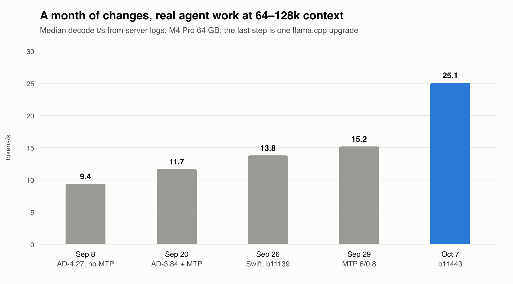
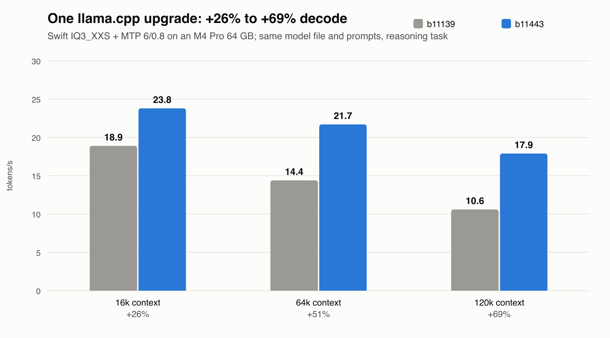

**One llama.cpp upgrade beat a month of tuning: Qwen3.8-Flash-Next on a 64 GB M4 Pro, +65% decode on real work**

A month ago I posted my [Flash-Next setup on a Mac mini M4 Pro 64 GB](2026-09-swift-m4pro.md). Since then I've changed quants, tuned MTP, tried every other runtime I could find, and upgraded llama.cpp twice. The surprise: **the last upgrade alone added more speed than everything before it combined.**

**TL;DR:** If you run Flash-Next on Apple Silicon, move to Unsloth's llama.cpp fork **[b11443-mix-d65395f](https://github.com/unslothai/llama.cpp/releases/tag/b11443-mix-d65395f)** or newer. It carries upstream's `qwen4exp` attention-mask fix (#29824). Same model file, same flags: decode **+26% at 16k, +51% at 64k, +69% at 120k context**. On my real agent work at 64–128k, the median went from **15.2 to 25.1 t/s**.

## What changed, and what each change bought

Same measure throughout: median decode (the server's 3-second rate, thinking tokens included) on every real request at 64–128k context in that period's server logs. My work is SQL-heavy agent sessions in the pi coding agent.

| From | Setup | Median t/s | Middle 50% | Requests | Step |
|---|---|---|---|---|---|
| Sep 8 | AtomicChat AD-4.27 Q4_K_M, no MTP, fork b10840 | 9.4 | 8.5–10.1 | 93 | – |
| Sep 20 | AtomicChat AD-3.84 IQ4_XS + MTP | 11.7 | 10.2–13.6 | 172 | +24% |
| Sep 26 | Swift 1.5 GSQ-RCO IQ3_XXS + MTP, fork b11139 | 13.8 | 12.2–15.5 | 158 | +18% |
| Sep 29 | Same, MTP draft tuned 2/0.0 → 6/0.8 | 15.2 | 12.4–18.6 | 594 | +10% |
| **Oct 7** | **Same, fork b11443** | **25.1** | **21.2–29.6** | **34** | **+65%** |

Three weeks of changes added 5.8 t/s. One upgrade added 9.9.

**Caveats:** the work differs from period to period, thinking effort was mixed before Sep 26, and the Oct 7 row has only 34 requests so far (one evening and morning). The controlled A/B below is the cleaner evidence.

## The controlled A/B

Same model file (Swift IQ3_XXS), same MTP head, same 6/0.8 draft settings, same prompts. Only the server binary changed.

| Context | Task | b11139 | b11443 | Gain |
|---|---|---|---|---|
| 16k | copy | 26.7 | 34.3 | +28% |
| 16k | reason | 18.9 | 23.8 | +26% |
| 64k | copy | 19.6 | 28.4 | +45% |
| 64k | reason | 14.4 | 21.7 | +51% |
| 120k | copy | 16.0 | 26.1 | +63% |
| 120k | reason | 10.6 | 17.9 | +69% |

- **The gain grows with context.** Before, decode roughly halved between 16k and 120k. Now it drops about a quarter. Most of my decode time is above 64k, so that's where it counts.
- **It was a fix, not tuning.** The `qwen4exp` mask fix removed a long-context attention bottleneck on Metal. Prefill rose too: +6% at 16k up to +33% at 120k.
- **It cost nothing.** Memory, MTP acceptance and copy fidelity were unchanged, and the weights are the same file.
- **Vision got faster too:** the same chart image decoded at 30.0 t/s, up from 24.8.
- Single runs each; run-to-run noise is about ±5%.

## It changed which quant wins

On b11139, decode was memory-bound, so smaller quants were faster: Swift GSQ-RCO **IQ2_XS** +4–11% and **Q2_0** +9–14% on copy work versus IQ3_XXS. I switched the default to IQ2_XS for a day.

After b11443, IQ3_XXS decodes as fast as IQ2_XS (120k reasoning: 17.9 vs 18.1). The bigger, more accurate quant is the default again; IQ2_XS would only buy ~8 GiB of headroom.

ISTA's model card claims Q2_0 gives 3.4× prefill and +33% decode over IQ2_XS because it skips lookup tables. **That didn't carry over to Metal:** prefill was within 1–3% here. The bottleneck on Apple's GPU was long-context attention, not lookup tables. (An indirect comparison: each was A/B'd against IQ3_XXS on the same day.)

## All the levers, ranked

| Lever | Typical decode gain | Note |
|---|---|---|
| **Upstream mask fix (b11443)** | **+26% → +69%, growing with context** | Free: no memory or quality cost |
| MTP speculative decoding | ~0% at 16k → +49% at 139k | Costs ~5 GiB; breaks even at ~2.4k output tokens |
| Fork b10840 → b11139 | +13–20% | Metal MoE fusion, FA tuning, KV −18% |
| MTP draft 6 / p-min 0.8 | +13–14% on code | Longer drafts need a p-min cut-off, or prose loses 13% |
| Smaller quant (IQ2_XS, Q2_0) | +4–14% on b11139, ~0 on b11443 | Only helped while memory-bound |
| Keeping context small | decode roughly halves 4k → 150k | Still the biggest lever you control |

## The setup now

- **Model:** [ukisai/Swift-1.5-Qwen3.8-Flash-Next-GSQ-RCO-GGUF](https://huggingface.co/ukisai/Swift-1.5-Qwen3.8-Flash-Next-GSQ-RCO-GGUF), IQ3_XXS
- **MTP head:** `MTP/mtp-Qwen3.8-Flash-Next-shared-Q8_0.gguf` from [unsloth/Qwen3.8-Flash-Next-GGUF](https://huggingface.co/unsloth/Qwen3.8-Flash-Next-GGUF)
- **Server:** Unsloth fork [b11443-mix-d65395f](https://github.com/unslothai/llama.cpp/releases/tag/b11443-mix-d65395f). Mainline still won't fit Swift on 64 GB (no lazy read of the 26.8 GB n-gram table, no Metal `Q2_0`).
- **Flags:** unchanged from last time. Full script with download commands: [`setup/run-swift-mtp.sh`](../setup/run-swift-mtp.sh)
- **Memory:** 56.7 GiB wired at idle (57.8 with vision) of a 60 GiB limit; swap flat.

## Who made it fast

Six groups supply the parts, and the speed came from the runtime side:

- **Qwen:** the model, including the MTP head.
- **AtomicChat:** the base-model quants I started on.
- **ISTA-DASLab:** the GSQ-RCO quantisation method (learned rounding plus a per-tensor bit budget).
- **UkisAI:** the Swift 1.5 fine-tune (thinks ~56% less), quantised with ISTA's allocation.
- **Unsloth:** the fork: MTP for `qwen4exp` before upstream, lazy reads of large tensors, Metal `Q2_0`.
- **ggml-org:** upstream llama.cpp, where the mask fix came from.

The full month (provider diagrams, quality tables, everything I tried and rejected) is in [`history/flash-next-history.md`](../history/flash-next-history.md).

## Tried and rejected since last time

- **ISTA's base-model GSQ-RCO builds:** same quant error as Swift tier for tier, but the base model thinks ~1.7× longer. IQ3_S (their recommended tier, 83.6 GB) doesn't fit.
- **ISTA GSQ-RCO Coder:** pruned to 256 of 512 experts. It saves memory, not decode compute.
- **oMLX:** no MTP build that fits 64 GB. **LM Studio:** can't load `qwen4exp`. **MTPLX:** needs 96 GB+.
- **SSD expert-streaming forks:** only help models that don't fit in RAM.
- **adriandj3 "Swift MTP":** the same base head re-uploaded, not trained on Swift.

## Also in the repo

The agent instructions and small tools I use day to day with this setup:

- [`agents/`](../agents/): the global `AGENTS.md` I give every coding agent (pace, scope, top-down explanations, diagrams), plus PONYTAIL.
- [`tools/md-table-fit`](../tools/md-table-fit): rewraps over-wide Markdown tables, with `--join` to read them unwrapped.
- [`tools/md2pdf`](../tools/md2pdf): Markdown to PDF offline, with Mermaid diagrams drawn.
- SQL tools (a SQL Server 2016 query checker and a T-SQL layout formatter) are in a separate repo: [leastsurprise/sql-tools](https://github.com/leastsurprise/sql-tools).
