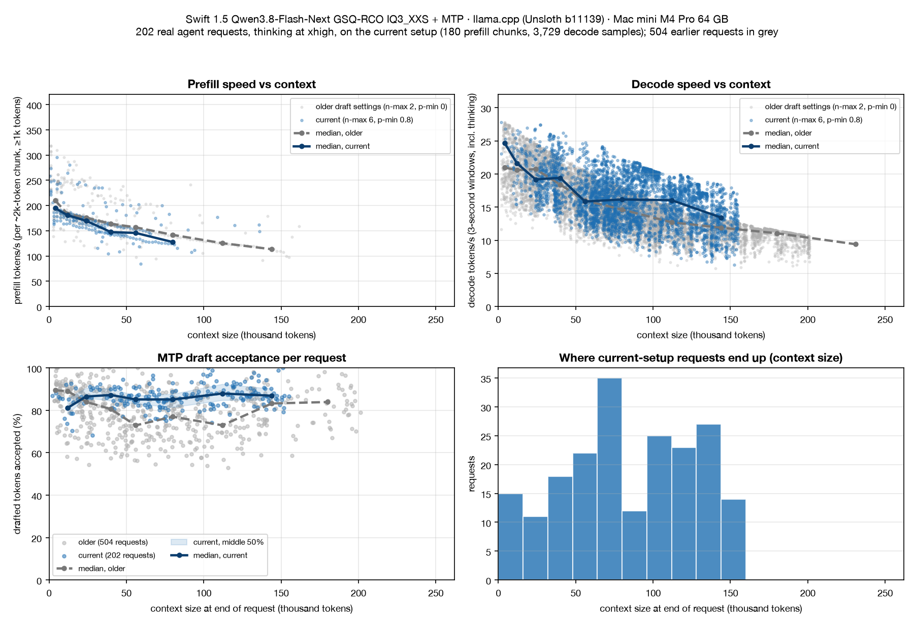

**Qwen3.8-Flash-Next (Swift 1.5) on a Mac mini M4 Pro 64 GB: what actually works (llama.cpp, MTP, lots of numbers)**

I've spent a week getting [Qwen3.8-Flash-Next](https://huggingface.co/Qwen/Qwen3.8-Flash-Next) (the 512-expert MoE) usable on a 64 GB M4 Pro mini (macOS 26.6.2). TL;DR: use UkisAI's Swift 1.5 in GSQ-RCO IQ3_XXS with the MTP head, set the draft to n-max 6 / p-min 0.8, and keep your context small.

## Recommended setup

- **Model:** [ukisai/Swift-1.5-Qwen3.8-Flash-Next-GSQ-RCO-GGUF](https://huggingface.co/ukisai/Swift-1.5-Qwen3.8-Flash-Next-GSQ-RCO-GGUF), IQ3_XXS (2 shards, ~76 GB on disk).
- **MTP head:** `mtp-Qwen3.8-Flash-Next-shared-Q8_0.gguf` (2.6 GB) from the `MTP/` folder of [unsloth/Qwen3.8-Flash-Next-GGUF](https://huggingface.co/unsloth/Qwen3.8-Flash-Next-GGUF). It's the base model's head, not one trained on Swift, and it still works well.
- **Server:** Unsloth's llama.cpp fork, release [`b11139-mix-a6922cc`](https://github.com/unslothai/llama.cpp/releases/tag/b11139-mix-a6922cc) (`--version` reports build 11139, commit `d79953103`).
  - It reads tensors over 4 GiB lazily from the CPU, so the 26.8 GB n-gram table never lands in pinned GPU memory. That's the only reason this fits.
  - It supports the `Q2_0` expert tensors.
  - It shrinks the KV cache to 14,688 bytes per token (down from 17,952).
- **One-off setup:** `sudo sysctl iogpu.wired_limit_mb=61440`

```
llama-server -m Swift-Qwen3.8-Flash-Next-GSQ-RCO-IQ3_XXS-00001-of-00002.gguf \
  -ngl 99 -c 262144 --jinja -fit off -fa on -ctk q8_0 -ctv q8_0 --parallel 1 \
  --reasoning-effort xhigh --reasoning-budget 32768 --cache-ram 0 \
  -md mtp-Qwen3.8-Flash-Next-shared-Q8_0.gguf --spec-type draft-mtp \
  --spec-draft-n-max 6 --spec-draft-p-min 0.8 \
  --temp 1.0 --top-p 0.95 --top-k 20 --min-p 0.0 --presence-penalty 0.0
```

**Memory:** GPU memory stays pinned at about 55 GiB, leaving apps ~3–4 GiB with MTP (~9 GiB without). Swap stayed flat across 160k-token prompts.

## Speed vs context (current setup, 202 real agent requests, thinking at xhigh)

**My workload:** SQL-heavy (T-SQL, stored procedures up to ~140k tokens), run through the pi coding agent. Most work is one-shot: do the task, compress the context, carry on. I save Ralph loops (a fresh session per step) for rarer, larger projects.

**Every request here ran at `reasoning_effort` xhigh** with a 32k thinking budget. The pi sessions were set to xhigh (their session files confirm it, with no changes mid-session), and xhigh is also the server default.



Medians from the server logs. Decode uses 3-second windows (3,729 samples) and includes thinking tokens. Prefill uses ~2k-token chunks. Context is the true KV position, reused cache included. MTP acceptance is per request, shown as the median with the middle 50% in brackets.

| Context | Prefill t/s | Decode t/s | MTP acceptance |
|---|---|---|---|
| 0–8k | 195 | 25† | –† |
| 8–16k | 181 | 22 | 81% (78–86) |
| 16–32k | 170 | 19 | 87% (86–91) |
| 32–48k | 147 | 19 | 87% (85–90) |
| 48–64k | 146 | 16 | 85% (83–87) |
| 64–96k | 128 | 16 | 85% (81–88) |
| 96–128k | 125* | 16 | 88% (85–92) |
| 128–160k | 113* | 13 | 87% (85–90) |

\*Fewer than 5 prefill chunks on the current setup, so these use my earlier MTP logs. Prefill doesn't depend on draft settings.
†Very few requests start this small in my workflow: 6 decode samples, and fewer than 5 requests with acceptance data.

Overall, 86.9% of drafted tokens were accepted (145k of 167k). Across all 202 requests acceptance ranged from 68% to 100%.

- **Context is the biggest speed lever:** decode roughly halves between 4k and 150k. That's why I compress after each one-shot task instead of letting a session grow.
- **Real sessions keep the cache warm:** most turns only prefill a few hundred new tokens, so at 100k+ the waiting is mostly decode.
- **Acceptance doesn't fall with context,** at least on SQL work, where output often echoes the context and suits drafting; prose-heavy work will accept less. With `p-min 0.8` the median stays between 81% and 88% at every depth, because the head simply drafts less when it's unsure. The old `n-max 2, p-min 0` settings sagged to 73–77% between 48k and 128k.
- **So the decode drop at depth is attention cost, not MTP giving up.** The new settings hold ~16 t/s from 48k to 128k, where the old ones fell to 13–15. That's from different sessions, not a controlled test, and the older logs mix medium- and xhigh-effort sessions.

## MTP findings

- **It helps on Metal for this model, despite reports that MTP loses on Apple Silicon.** At 16k it's roughly neutral: 19.9 vs 19 t/s. At 139k context decode went **7.8 → 11.6 t/s (+49%)**, with 75% of drafts accepted. Chat SQL work hit 26 t/s with 92% accepted. MTP costs about 5 GB of memory and a few percent of prefill.
- **Draft tuning** (6 settings, medium effort, 1,200-token outputs; two runs of the default differed by at most 4%):

| n-max / p-min | Code, 28k | Prose, 28k | Code, 59k |
|---|---|---|---|
| 2 / 0.0 (default) | 22.5 | 18.7 | 19.5 |
| 3 / 0.0 | 24.4 | 18.3 | 20.4 |
| 4 / 0.0 | 24.1 | **16.3** | 21.7 |
| 4 / 0.75 | 24.9 | 19.6 | 21.7 |
| **6 / 0.8** | **25.4** | 19.2 | **22.3** |

Longer drafts only pay off with a `p-min` cut-off. Without one, only half of prose drafts are accepted and you lose 13%.

## Other things I tried

- **`--spec-type ngram-mod`:** looks like 2× in raw completion benchmarks, but that's an artefact. It's about 10–20% in real chat, and MTP beats it.
- **`--cache-ram 0`:** stops the prompt cache in system RAM from eating the little headroom you have.
- **Wider context with YaRN (1.5–2×):** possible without MTP (up to ~524k), but decode would be ~4–5 t/s. Split the work instead.
- **[MTPLX](https://github.com/youssofal/MTPLX) (MLX with native MTP):** reports ~2× llama.cpp on an M5 Max, but its smallest build is 4-bit (106 GB+) and needs 96 GB of RAM. Not an option here.
- **High Power Mode:** already on by default on this mini.
- **Gotcha:** the chat template only accepts `xhigh`/`medium`/`low` for reasoning effort. Clients that send `high` get an HTTP 500.

## Previous setups

- **Tried and rejected:**
  - Swift Q2_K_L from [ukisai/Swift-1.5-Qwen3.8-Flash-Next-GGUF](https://huggingface.co/ukisai/Swift-1.5-Qwen3.8-Flash-Next-GGUF): only 77% top-token agreement with full precision (see the quality table below).
  - The [ashbash/Qwen3.8-Flash-Next-MTP-Drafter-GGUF](https://huggingface.co/ashbash/Qwen3.8-Flash-Next-MTP-Drafter-GGUF) drafter: it declares a `qwen4exp-mtp` architecture that llama.cpp rejects.

- **Base Flash-Next, 3.84 bpw ([AtomicChat/Qwen3.8-Flash-Next-GGUF](https://huggingface.co/AtomicChat/Qwen3.8-Flash-Next-GGUF), AD-3.84bpw IQ4_XS), 1.25× context with MTP, older llama.cpp:** worked, but was slower and ran out of memory at larger contexts.
- **Base Flash-Next, 4.27 bpw (same repo, AD-4.27bpw Q4_K_M), full 262k, no MTP:** pinned 51.6 GiB of weights and left macOS ~0.6 GiB, so the desktop was unusable and swap kept growing. With MTP, the maximum context dropped to 131k.
- **Swift vs 4.27, both at medium effort:** equal accuracy on my tests, including a 139k-token procedure review and recall of a planted fact at 166k. Swift used 8–24% fewer thinking tokens.

## Quality vs the full-weight model

Publishers' own numbers. Lower KL divergence (KLD) and higher top-token agreement mean closer to full precision.

| Build (what I ran) | Compared with | Mean KLD | Same top token | Notes |
|---|---|---|---|---|
| **Swift 1.5 GSQ-RCO IQ3_XXS (current)** | Swift 1.5 BF16 | 0.074–0.174 (512 ctx; math 0.087, prose 0.116, code 0.119, Chinese 0.174) | not published | [eval file](https://huggingface.co/ukisai/Swift-1.5-Qwen3.8-Flash-Next-GSQ-RCO-GGUF/blob/main/evaluation/heldout-kld.tsv) |
| Swift 1.5 Q2_K_L (tried, deleted) | Swift 1.5 BF16 | 0.543 (wikitext, 512) / 0.387 (32k) | 77.3% (32k) | 99th-percentile KLD 3.65 |
| AD-4.27bpw Q4_K_M (base) | Flash-Next BF16 | 0.084 | 89.5% | Perplexity +2.6% |
| AD-3.84bpw IQ4_XS (base) | Flash-Next BF16 | 0.228 | 82.7% | Perplexity +10.2% |

**How to read it**

- **The rows aren't directly comparable.** The KLD figures come from different texts and context lengths, and the Swift rows measure distance from Swift BF16, not from the base model.
- **Swift itself vs base** (UkisAI, both BF16, xhigh): GPQA-Diamond −0.2, IFBench −3.1, AIME −2.0, LiveCodeBench +2.0, Terminal-Bench +2.0. It thinks 56% less on average. At medium effort GPQA is −2.7 (83.7 vs 86.4).
- **Two layers of loss for the current setup:** the Swift fine-tune costs a point or two on some benchmarks, then IQ3_XXS adds a modest quant error (KLD ~0.1 on most text, closer to AD-4.27 than to AD-3.84, with the caveat above). On my own tasks it still matched AD-4.27, the most accurate build I could fit.
- **Gaps:**
  - Nobody publishes long-context KLD for the GSQ-RCO quant.
  - The MTP head doesn't affect quality; drafts are verified by the main model.
  - `q8_0` KV-cache error comes on top of all of these for every build.
