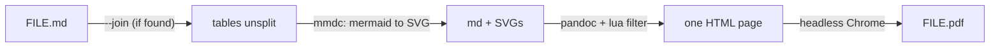

# md2pdf: Markdown to PDF, with the Mermaid diagrams drawn

`md2pdf FILE.md` writes `FILE.pdf` beside the source. It works offline:
GitHub renders Mermaid in the browser, but a PDF that you mail or print
needs the diagrams already drawn.



```sh
md2pdf FILE.md                 # writes FILE.pdf; prints its path
md2pdf docs/*.md               # several at once; exit 1 if any failed
MD2PDF_CHROME=/path/to/chrome md2pdf FILE.md
```

## What it does

- **Draws every ```` ```mermaid ```` block** as an SVG via mermaid-cli. A
  block that does not parse fails the file (exit 1, error on stderr), so a
  broken diagram is never shipped silently.
- **Reads YAML front matter as metadata** rather than printing it.
- **Prints tables unsplit.** If it finds [`md-table-fit`](../md-table-fit/)
  (in a `tools/md-table-fit/` folder above the file, or beside this script),
  it runs `--join` first, so wrapped table rows print as one row each.
- **Shrinks code blocks too wide for the page** (down to 5 pt) instead of
  cutting them off.
- **Turns pages for wide diagrams.** A diagram that prints larger in
  landscape gets a landscape A4 page of its own.

## Requirements

| Need | Install |
|---|---|
| `mmdc` (mermaid-cli) | `npm install -g @mermaid-js/mermaid-cli`. This also fetches a `chrome-headless-shell` into `~/.cache/puppeteer`, which md2pdf reuses. |
| `pandoc` | `brew install pandoc` or `apt install pandoc` |
| headless Chrome | Found in this order: `$MD2PDF_CHROME`; puppeteer's newest `chrome-headless-shell`; `chromium` or `google-chrome` on PATH; the macOS Google Chrome app |
| `python3` | Optional, only for the md-table-fit join step |

The Lua filter and the HTML template are written inline by the script, so
there is nothing else to install. Put the script on your PATH:

```sh
ln -s "$PWD/tools/md2pdf/md2pdf" ~/.local/bin/md2pdf
```

## Auto-run from the pi coding agent

`pi-extension/md2pdf.js` is a [pi](https://github.com/badlogic/pi-mono)
extension. After every `write` or `edit` to a `.md` file that holds a mermaid
block, or a `bash` call that changed one, it runs md2pdf and appends the
result to the tool output. If a diagram fails to parse, the model sees
`md2pdf FAILED` and fixes it.

```sh
cp tools/md2pdf/pi-extension/md2pdf.js ~/.pi/agent/extensions/
```

It finds `md2pdf` on PATH, or at `$MD2PDF`. Where md2pdf isn't installed it
does nothing. It skips `.git`, `node_modules`, `data`, `_extracted` and
virtualenvs when looking for files a bash command changed.
